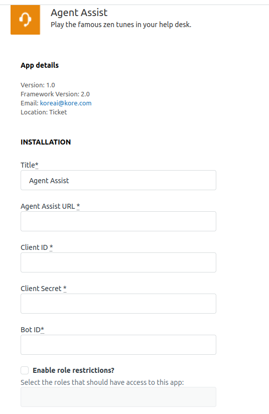
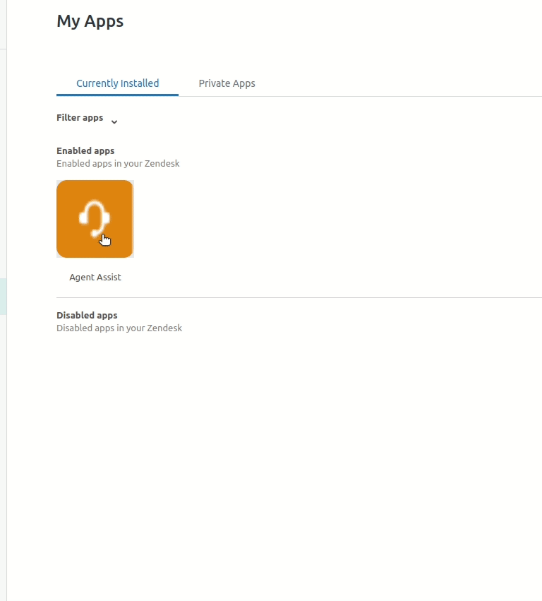
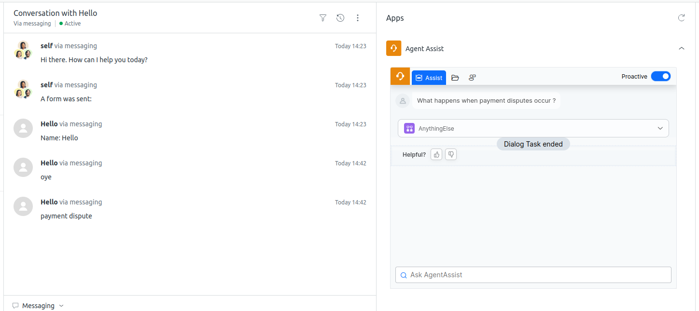

# Installation Instructions

By simple click on install button you will be redirected to page like below.

  We need to fill the mandaotry fileds with appropriate values.
  
* Agent Assist URL
* Client ID
* Client Secret
* Bot ID

To get the above details you should have account in https://uat-smartassist.kore.ai/

After entering all the required details, click on install.

Suppose if you wanted to change any of the above details after installation i.e if you entered the wrong details or if you wanted to change bot configuaration details.

Please go to Zendesk Admin center &#8594; Apps and Integrations &#8594; Zendesk Support apps 

Click on the app that you wanted to change the settings.

Sample Screen of the application is below.

